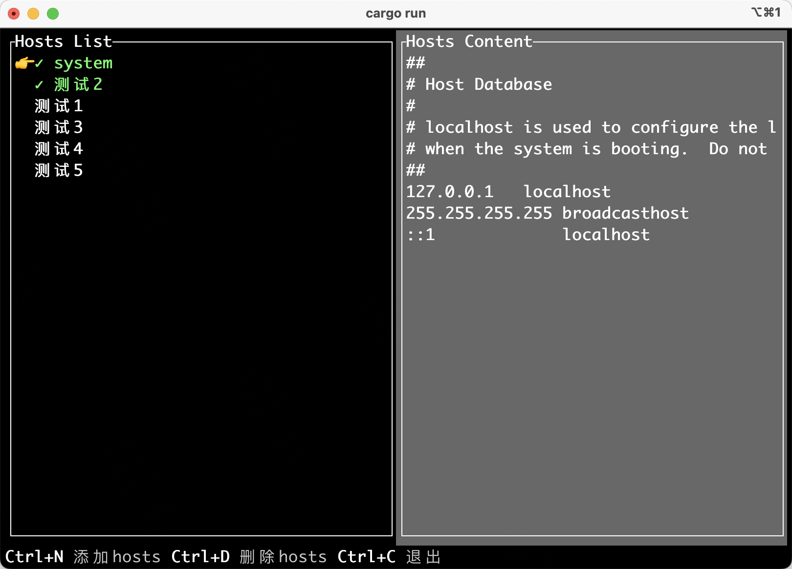

# switchhosts-rs

一个Rust写的用于管理Hosts的工具，基于ratatui开发

## License

Copyright (c) nieyuyao

This project is licensed under the MIT license ([LICENSE] or <http://opensource.org/licenses/MIT>)

[LICENSE]: ./LICENSE

## Screenshot

## 快捷键

[TODO]